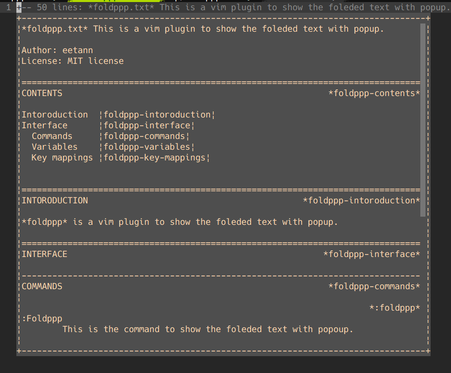

# foldppp
This is a vim plugin to show the foleded text with popup.  
  

# COMMANDS
*:Foldppp*  
This is the command to show the foleded text with popoup.  

# VARIABLES
*g:foldppp_maxheight*  
This is a variable to decide popup window height.  
(default: 30)  

# KEY MAPPINGS
*<Plug>(foldppp-show)*  
Show the foleded text.  

example  
```vim
nmap <leader>s <Plug>(foldppp-show)
```
